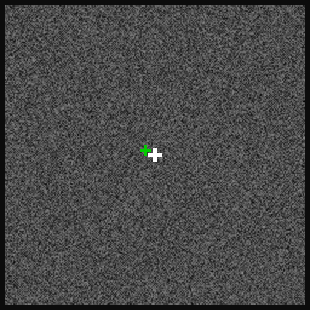

# Working Memory of Multi-Object Scenes in Primate Frontal Cortex

## Introduction

This webpage is the entrypoint for the code and data supporting the paper
"Working Memory of Multi-Object Scenes in Primate Frontal Cortex" (Watters et
al., 2025). This paper studies the neural mechanisms of multi-object working
memory in the primate brain. It involves neurophysiology data collected from
monkeys trained on a working memory task and computational modeling to test
hypotheses of neural mechanisms in that data.

This website is intended for users who want to replicated the results in our
paper or want to use our data for your own research.

Here's a video of our multi-object working memory task (played by a monkey whose
gaze position is the green cross):



And here's a video where you can listen to neurons recorded simultaneously with
the task:
[](https://www.youtube.com/watch?v=MbDBzNsw81M)

## Codebase Organization

Our [codebase](https://github.com/jazlab/multi_object_memory_2025) is written
entirely in python, and consists of the following directories:
* `figures/`: This directory contains code to generate the figures in our paper.
It contains one sub-directory for each figure, and Jupyter notebooks to produce
specific plots.
* `cache/`: This directory contains data needed to generate the figures. The
data is too large to include in this GitHub repo, but instead can be found on
our OSF repo at [https://osf.io/vyw49](https://osf.io/vyw49). See "Getting
Started" for details.
* `behavior_processing/`: This directory contains code for processing our raw
behavior data into a form that can be used to generate our figures. See
`behavior_processing/README.md` for details.
* `phys_processing/`: This directory contains code for processing our physiology
data into a form that can be used to generate our figures. See
`phys_processing/README.md` for details.
* `phys_modeling/`: This directory contains code for our physiology modeling
paradigm. See `phys_modeling/README.md` for details.
* `task_visualization/`: This directory contains code for visualizing our task,
the monkeys' behavior, and neural data. See `task_visualization/README.md` for
details.

## Usage

### Getting Started

Navigate to our codebase: https://github.com/jazlab/multi_object_memory_2025

Download that repository by downloading it as a zip from GitHub or cloning using
git commands.

Before running any code, we recommend using a virtual environment (e.g. using
miniconda or pipenv) to manage dependencies. Once in a virtual environment with
python version at least 3.10.0, install the necessary dependencies with:
```
pip install -r requirements.txt
```

### Download and familiarizing Yourself With Our Data

Go to [https://osf.io/vyw49](https://osf.io/vyw49) and download
`data_for_figures.zip`. This is ~4.5 GB zipped and ~10.5 GB unzipped, so be sure
you have enough storage space. Unzip the resulting file. It will contain folders
`behavior_processing`, `dandi_data`, `figures`, `modeling`, and
`phys_processing`. Move these folders all to the `cache/` directory.

Now you can familiarize yourself with our data by doing two things:
1. Visualize a trial by opening and running the Jupyter notebook
`./task_visualization/demo_replay_trial.ipynb`.
2. Plot a neuron's PSTH by opening and running the Jupyter notebook
`./phys_processing/psths/demo.ipynb`.

To further familiarize yourself with our data, you can also look at PSTHs and
summary plots for all of our recorded units from our OSF dataset. In the
`phys_processing` folder of the cache you downloaded and unzipped, you will see
the folders `psths` and `unit_summary_plots`. Inside `psths` you can find PSTH
plots for all of our units labeled `good` (single neurons) by our spike sorting
pipeline. Inside `unit_summary_plots` you can find PSTH plots for all of our
recorded units. We recommend looking through some of the PSTHs to both the
diversity of responses across units and get an intuition for common patterns of
modulation. Our best sessions are `Perle/2022-05-31` and `Perle/2022-06-01`, so
we recommend starting there.

### Reproducing Figures

The code to generate each of the figures in our paper is in `./figures/`. Each
directory there corresponds to one figure, with Jupyter notebooks that generate
plots for each panel in the figure. After you have downloaded our data and
propagated the `cache` directory, each of these notebooks can be run.

### Full Data Processing Pipeline

We have open-sourced all of our data, including behavior, task, raw physiology,
and spike-sorted physiology, on DANDI as
[dataset 000620](https://dandiarchive.org/dandiset/000620). You can download
that data using the script `./download_dandi_data.py` (see documentation at the
top of that file for instructions). However, note that the raw physiology data
is several terabytes, so we recommend only downloading the behavior/task and
spike-sorted physiology data.

To replicate our data processing pipeline from the DANDI data files, you must
first convert the raw task/behavior files to dataframes by navigating to
`./behavior_processing` and running `run_cache_data.py` there.

To process the spike-sorted DANDI physiology files, for each unit you must
extract spike times per trial and compute AUC selectivity metrics. See the
documentation and scripts in `./phys_processing` for how to do that. These
scripts take several hours to run on a laptop, so we do not recommend running
them. We've provided the results of these scripts in `/cache/`, so you do not
have to re-run them to reproduce our figures.

If you want to spike-sort our raw data, we have provided the raw physiology
files on DANDI. We spike-sorted these by doing drift correction, running
Kilosort 2.5, applying custom automated quality labeling pipeline, and manually
curating the results. Our spike-sorting pipeline is not included in this
package, but we recommend looking at the
[SpikeInterface](https://spikeinterface.readthedocs.io/en/stable/) toolkit if
you'd like to spike-sort yourself.

## Contact and Support

Please email Nick Watters at
[nwatters@mit.edu](mailto:nwatters@mit.edu) with questions and feedback. If you
plan to use our data for your own research, we encourage you to email Nick
Watters ([nwatters@mit.edu](mailto:nwatters@mit.edu)) or Mehrdad Jazayeri
([mjaz@mit.edu](mailto:mjaz@mit.edu)) so we can help you determine whether our
data is useful for your scientific goals and discuss any limitations or
challenges that might arise.

<!-- ## Reference

If you use our data or code (or a derivative of our data or code) in your work,
please cite it as follows:

TODO(nwatters): Add citation. -->

<!-- ```
@article {Watters2024.11.06.622160,
	author = {Watters, Nicholas and Buccino, Alessio P and Jazayeri, Mehrdad},
	title = {MEDiCINe: Motion Correction for Neural Electrophysiology Recordings},
	elocation-id = {2024.11.06.622160},
	year = {2024},
	doi = {10.1101/2024.11.06.622160},
	URL = {https://www.biorxiv.org/content/10.1101/2024.11.06.622160},
	eprint = {https://www.biorxiv.org/content/10.1101/2024.11.06.622160.full.pdf},
	journal = {bioRxiv}
}
``` -->
