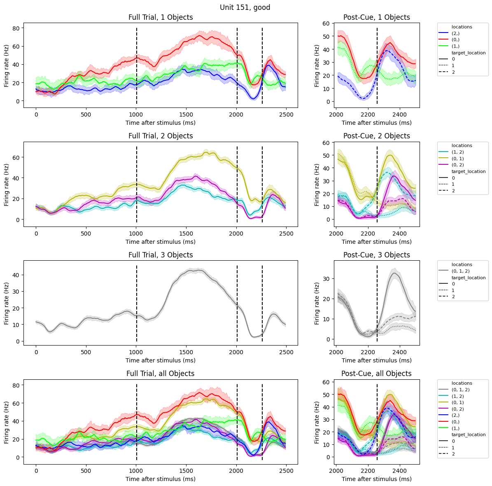
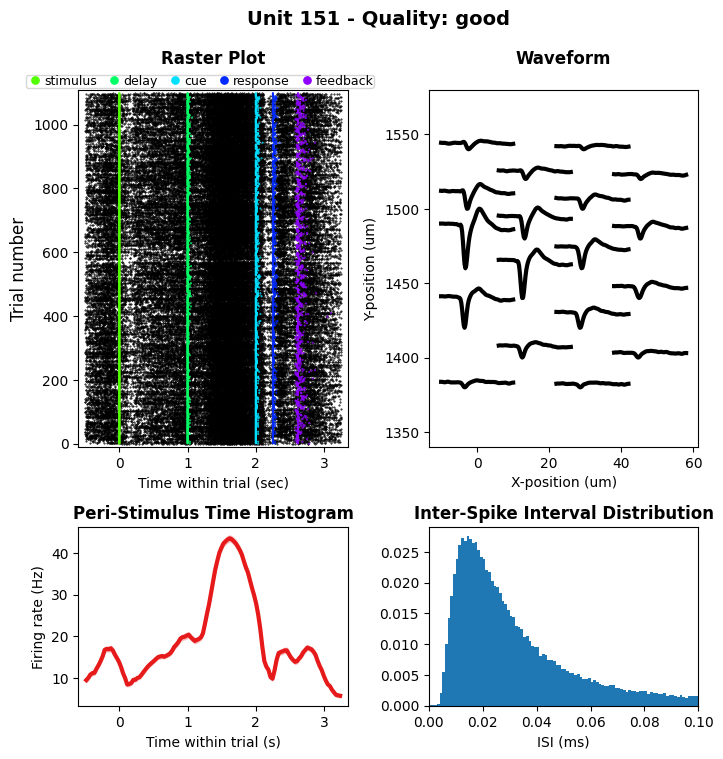

# Physiology Data Processing

This directory contains tools to process physiology data. It has the following
directories:

## spikes_to_trials

This directory contains tools to process spikesorting nwb files and generate
intermediate physiology datatypes that are necessary for further analyses. This
intermediate data are cached in `../cache/phys_processing/spikes_to_trials/`.

This GitHub repo contains these intermediate data files, so if you have cloned
the repo (including the cache), you do not need to re-run the scripts in
`spikes_to_trials/`.

If for any reason you want to re-generate these intermediate data files,
navigate to `spikes_to_trials/` and first run `$ python run_spikes_per_trial.py`
then run `$ python run_firing_rates_per_phase.py`. The first script will
compute and cache binned spike trains for every unit for every trial, and the
second script will compute and cache firing rates of every unit during the delay
phase of every trial.

## selectivity

This directory contains tools to compute the task-selectivity of units, namely
AUC values and p-values, which are used as a basis for determining which units
to include in the modeling datasets. These selectivity files are cached in
`../cache/phys_processing/selectivity/`.

This GitHub repo contains these cached selectivity files, so if you have cloned
the repo (including the cache), you do not need to re-run the scripts in
`selectivity/`.

If for any reason you want to re-generate the selectivity files, navigate to
`selectivity/` and run `$ python run_cache_selectivity.py`. This will iterate
through sessions and compute the selectivity of all units. In
`../cache/phys_processing/selectivity/`, for each session this will save a
`units.csv` dataframe with columns including `Position p-value`, `Position AUC`,
`Identity p-value`, `Identity AUC`, and `significant`.

## psths

This directory contains tools to generate PSTH plots for units. Please navigate
to `psths/` and run the Jupyter notebook `demo.ipynb` to view an example PSTH
plot, which looks like this:

If you want to see PSTHs plots for all of our single units, you can see them in
`../cache/phys_processing/psths`.

If you want to generate and cache PSTH plots yourself, navigate to `psths/` and
run `$ python run_triangle.py` for Triangle dataset units and
`$ python run_ring.py` for Ring dataset units. These will cache the resulting
PSTH plots in `../cache/phys_processing/psths/`. Note that they take a long
time to run, so we highly recommmend downloading them from the OSF cache
instead.

## unit_summary_plots

This directory contains tools to generate unit summary plots. Please navigate to
`unit_summary_plots/` and run the Jupyter notebook `demo.ipynb` to view an
example unit summary plot, which looks like this:

If you want to see unit summary plots for all of our recorded units, you can see
them in `../cache/phys_processing/unit_summary_plots`.

If you want to generate and cache unit summary plots for all units, navigate to
`unit_summary_plots/` and run `$ python run.py`. This will cache the resulting
plots in `../cache/phys_processing/unit_summary_plots/`. Note that they take
a long time to run, so we highly recommend downloading them from the OSF cache
instead. You also must download the DANDI behavior and spike sorting data for
all sessions before running unit summary plots.
